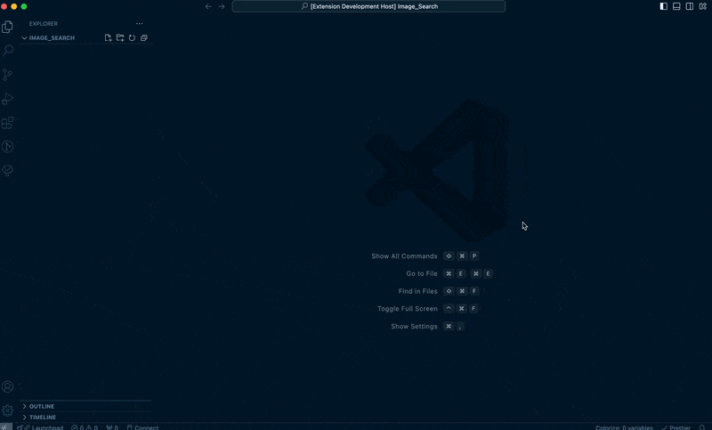

# 

This extension allows you to search for images on Pixabay directly from within VS Code and download them to your workspace.

While the preview images are low resolution, the downloaded images are medium sized.

Using the [Pixabay API](https://pixabay.com/api/)

Check their [Content license](https://pixabay.com/service/terms/)

## Features

- **Search Images**: Enter a description to search for images on Pixabay.
- **View Results**: Display search results with thumbnails in a webview.
- **Download Images**: Click on an image to download it directly to your workspace.

## Requirements

- **VS Code**: Ensure you are using the latest version of Visual Studio Code.
- **Internet Connection**: Required to fetch images from the Pixabay API.

## Extension Settings

This extension uses the following settings:

- `image-search.pixabayAPIKey`: Your Pixabay API key for accessing image search functionality. You can set this using the command `Image Search: Set Pixabay API Key`.

## Known Issues

- **Needs caching**
- **Needs Testing**
- **No Workspace Folder Open**: If no workspace folder is open, the extension will not be able to save downloaded images.
- **API Key Required**: The extension requires a valid Pixabay API key. Ensure you set it before attempting to search for images.

## Release Notes

### 0.0.1

Still working on it

---

### Icon

Icon generated with Microsoft Bing ∙ 17 September 2024 at 8:55 pm
